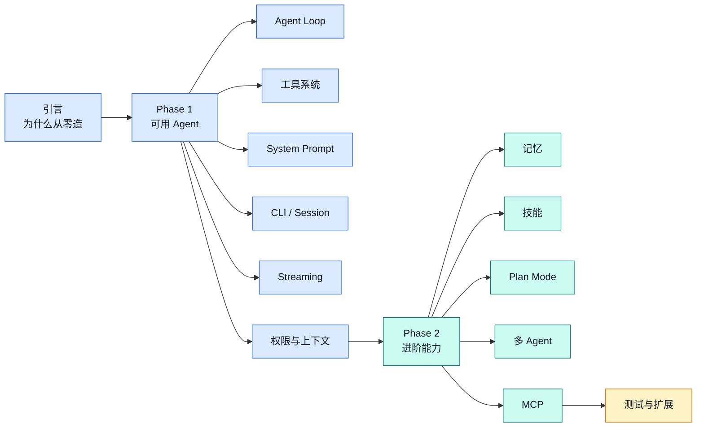
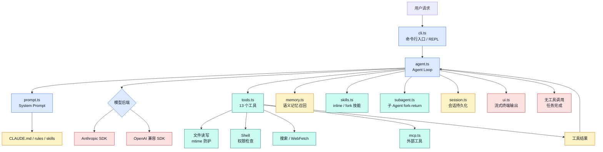
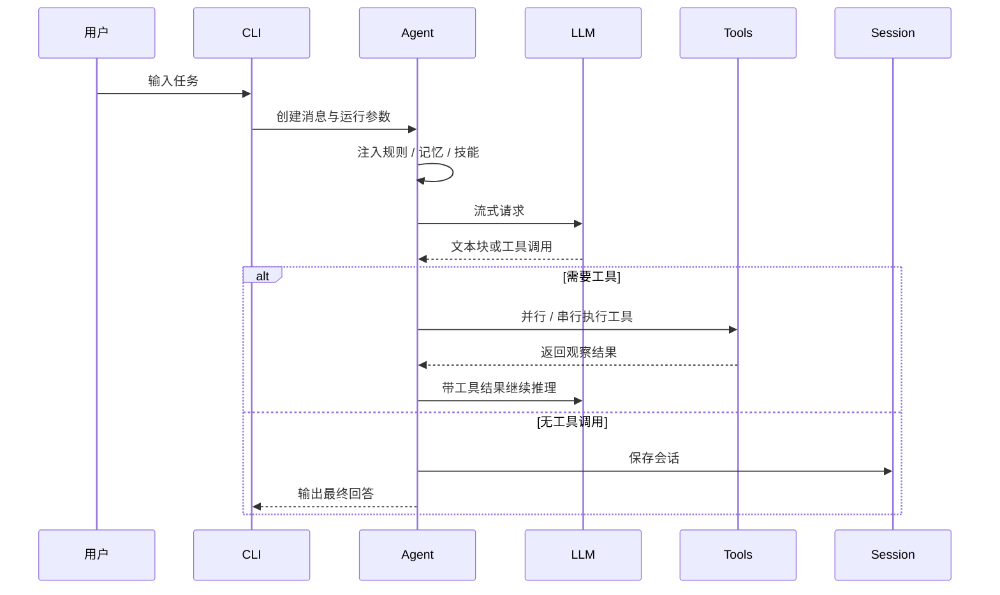

<div align="center">

# Claude Code From Scratch

**一步一步，从零造一个 Claude Code**

[](https://github.com/yfrcg/claude-code-from-scratch)
[](https://github.com/yfrcg/claude-code-from-scratch/fork)
[](./LICENSE)
[](#)
[](#)
[](#)
[](https://yfrcg.github.io/claude-code-from-scratch/)
[](#-可视化架构)

<br/>

[**📘 在线阅读教程 →**](https://yfrcg.github.io/claude-code-from-scratch/)
&nbsp;&nbsp;|&nbsp;&nbsp;
[📘 Read Tutorial (English) →](https://yfrcg.github.io/claude-code-from-scratch/#/en/)
&nbsp;&nbsp;|&nbsp;&nbsp;
[English](./README_EN.md)

<br/>

> 📖 **想深入了解原理？** 姊妹项目 **[How Claude Code Works](https://github.com/Windy3f3f3f3f/how-claude-code-works)** — 12 篇专题，33 万字，从源码级别深度解析 Claude Code 架构

</div>

---

**Claude Code 开源了 50 万行 TypeScript。读不动？**

本项目用 **~4300 行代码**（TypeScript 和 Python 两个版本分别实现）复现了 Claude Code 的核心架构——Agent Loop、13 个工具（含并行执行 + 流式早期启动）、4 层上下文压缩、语义记忆召回、技能系统、多 Agent、MCP 集成……每一步都对照真实源码讲解"它怎么做的 → 我们怎么简化的"。

这不是 demo，是一份**分步教程**——从引言到 14 个专题章节，跟着动手写几千行代码，快速理解 Claude Code 这样最好用的 coding agent 的精髓。读完你就理解了 coding agent 的工作原理，无需啃那几十万行代码。

<div align="center">
  <video src="https://github.com/user-attachments/assets/4f6597e2-6ea3-45ae-8a6b-77662c4e9540" width="100%" autoplay loop muted playsinline></video>
</div>

## 项目亮点

| 你关心的点 | 本项目怎么覆盖 |
|------|------|
| 从零理解 Agent | 用最小闭环讲清楚 `模型决策 → 工具执行 → 结果反馈 → 继续迭代` |
| 对照真实源码 | 每章都标注 Claude Code 对应源码模块，降低直接读 50 万行源码的门槛 |
| 可运行实现 | TypeScript / Python 双版本，支持 Anthropic 与 OpenAI 兼容后端 |
| 工程化能力 | 覆盖权限、上下文压缩、记忆、技能、多 Agent、MCP、预算控制、会话持久化 |
| 发布可读性 | README、在线文档、测试指南、架构图和中英文教程同步维护 |

## 学习路线



## 📖 分步教程

14 个专题章节，分两个阶段——先构建一个可用的 Coding Agent，再逐步添加进阶能力。每章都贴真实代码 + Claude Code 源码对照：

| 章节 | 内容 | 对应源码 |
|------|------|---------|
| **Phase 1: 构建一个可用的 Coding Agent** | | |
| [1. Agent Loop](https://yfrcg.github.io/claude-code-from-scratch/#/docs/01-agent-loop) | 核心循环：调用 LLM → 执行工具 → 重复 | `agent.ts` ↔ `query.ts` |
| [2. 工具系统](https://yfrcg.github.io/claude-code-from-scratch/#/docs/02-tools) | 13 个工具 + mtime 防护 + 延迟加载 | `tools.ts` ↔ `Tool.ts` + 66 工具 |
| [3. System Prompt](https://yfrcg.github.io/claude-code-from-scratch/#/docs/03-system-prompt) | 提示词工程 + @include 语法 | `prompt.ts` ↔ `prompts.ts` |
| [4. CLI 与会话](https://yfrcg.github.io/claude-code-from-scratch/#/docs/04-cli-session) | REPL、Ctrl+C、会话持久化 | `cli.ts` ↔ `cli.tsx` |
| [5. 流式输出](https://yfrcg.github.io/claude-code-from-scratch/#/docs/05-streaming) | 双后端 + 流式工具执行 + 并行执行 | `agent.ts` ↔ `api/claude.ts` |
| [6. 权限与安全](https://yfrcg.github.io/claude-code-from-scratch/#/docs/06-permissions) | 5 模式 + 声明式规则 + 危险检测 | `tools.ts` ↔ `permissions/` (52KB) |
| [7. 上下文管理](https://yfrcg.github.io/claude-code-from-scratch/#/docs/07-context) | 4 层压缩 + 大结果持久化 | `agent.ts` ↔ `compact/` |
| **Phase 2: 进阶能力** | | |
| [8. 记忆系统](https://yfrcg.github.io/claude-code-from-scratch/#/docs/08-memory) | 4 类型记忆 + 语义召回 + 异步预取 | `memory.ts` ↔ `memory.ts` |
| [9. 技能系统](https://yfrcg.github.io/claude-code-from-scratch/#/docs/09-skills) | 技能发现 + inline/fork 双模式 | `skills.ts` ↔ `SkillTool/` |
| [10. Plan Mode](https://yfrcg.github.io/claude-code-from-scratch/#/docs/10-plan-mode) | 只读规划 + 4 选项审批工作流 | `agent.ts` ↔ `EnterPlanMode` |
| [11. 多 Agent](https://yfrcg.github.io/claude-code-from-scratch/#/docs/11-multi-agent) | Sub-Agent fork-return 多 Agent 架构 | `subagent.ts` ↔ `AgentTool/` |
| [12. MCP 集成](https://yfrcg.github.io/claude-code-from-scratch/#/docs/12-mcp) | JSON-RPC over stdio 连接外部工具 | `mcp.ts` ↔ `mcpClient.ts` |
| [13. 架构对比](https://yfrcg.github.io/claude-code-from-scratch/#/docs/13-whats-next) | 完整对比 + 扩展方向 | 全局 |
| [14. 功能测试](https://yfrcg.github.io/claude-code-from-scratch/#/docs/14-testing) | 19 项手动测试覆盖全部功能 | `test/` |

## 🚀 快速开始

**TypeScript 版**

```bash
git clone https://github.com/yfrcg/claude-code-from-scratch.git
cd claude-code-from-scratch
npm install && npm run build
```

**Python 版**（需要 Python 3.11+，[详细说明](./python/README.md)）

```bash
cd python
pip install -e .
mini-claude-py          # 命令行入口（避免与 TS 版 mini-claude 冲突）
python -m mini_claude   # 或用 python -m 方式运行
```

### 配置 API

支持两种后端，通过环境变量自动识别：（支持自定义base url）

**方式一：Anthropic 格式（推荐）**

```bash
export ANTHROPIC_API_KEY="sk-ant-xxx"
# 可选：使用代理
export ANTHROPIC_BASE_URL="https://aihubmix.com"
```

**方式二：OpenAI 兼容格式**

```bash
export OPENAI_API_KEY="sk-xxx"
export OPENAI_BASE_URL="https://api.openai.com/v1"
```

默认模型为 `claude-opus-4-6`，可通过环境变量或命令行参数自定义：

```bash
export MINI_CLAUDE_MODEL="claude-sonnet-4-6"    # 环境变量方式
npm start -- --model gpt-4o                      # 命令行方式（优先级更高）
```

### 运行

**TypeScript 版**

```bash
npm start                    # 交互式 REPL 模式（推荐）
npm start -- --resume        # 恢复上次会话继续对话
npm start -- --yolo          # 跳过安全确认（危险命令自动执行）
npm start -- --plan          # Plan 模式：只分析不修改
npm start -- --accept-edits  # 自动批准文件编辑
npm start -- --dont-ask      # CI 模式：需确认的操作自动拒绝
npm start -- --max-cost 0.50 # 费用限制（美元）
npm start -- --max-turns 20  # 轮次限制
```

**Python 版**

```bash
mini-claude-py               # 交互式 REPL 模式（推荐）
mini-claude-py --resume      # 恢复上次会话继续对话
mini-claude-py --yolo        # 跳过安全确认
mini-claude-py --plan        # Plan 模式：只分析不修改
mini-claude-py --accept-edits # 自动批准文件编辑
mini-claude-py --dont-ask    # CI 模式：需确认的操作自动拒绝
mini-claude-py --max-cost 0.50 # 费用限制（美元）
mini-claude-py --max-turns 20  # 轮次限制
```

全局安装后可在任意目录使用：

**TypeScript 版**

```bash
npm link                     # 全局安装
cd ~/your-project
mini-claude                  # 直接启动
```

**Python 版**

```bash
cd python
pip install -e .             # 全局安装（editable 模式）
cd ~/your-project
mini-claude-py               # 直接启动
```

### REPL 命令

| 命令 | 功能 |
|------|------|
| `/clear` | 清空对话历史 |
| `/cost` | 显示累计 token 用量和费用估算 |
| `/compact` | 手动触发对话压缩 |
| `/memory` | 列出所有已保存的记忆 |
| `/skills` | 列出可用的技能 |
| `/<skill>` | 调用已注册的技能（如 `/commit`） |

> 详见 [CLI 与会话](https://yfrcg.github.io/claude-code-from-scratch/#/docs/04-cli-session) 和 [功能测试](https://yfrcg.github.io/claude-code-from-scratch/#/docs/14-testing)

## ⚖️ 与 Claude Code 的对比

| 维度 | Claude Code | Mini Claude Code |
|------|------------|-----------------|
| 定位 | 生产级编程智能体 | 教学 / 最小可用实现 |
| 工具数量 | 66+ 内置工具 | 13 个工具（6 核心 + web_fetch + tool_search + skill + agent + plan mode） |
| 工具执行 | 并发 + streaming 早期启动 | 并行执行 + streaming 早期启动 |
| 上下文管理 | 4 级压缩流水线 | 4 层压缩 + 大结果持久化（>30KB） |
| 权限系统 | 7 层 + AST 分析 | 5 种模式 + 声明式规则 + 正则检测 |
| 编辑验证 | 14 步流水线 | 引号容错 + 唯一性 + mtime 防护 + diff 输出 |
| 记忆系统 | 4 类型 + 语义召回 | 4 类型 + 语义召回 + 异步预取 |
| 技能系统 | 6 源 + inline/fork | 2 源 + inline/fork |
| 多 Agent | Sub-Agent + Coordinator + Swarm | Sub-Agent（3 内置 + 自定义 Agent） |
| MCP 集成 | mcpClient.ts + 动态工具发现 | McpManager + JSON-RPC over stdio |
| 预算控制 | USD/轮次/abort 三维 | USD + 轮次限制 |
| 代码量 | 50 万+ 行 | ~4300 行（TS）/ ~3800 行（Python） |

## ⚡ 核心能力

- **Agent 循环**：自动调用工具、处理结果、持续迭代，直到任务完成
- **13 个工具**：读写编辑文件（mtime 防护）、搜索、Shell、WebFetch、ToolSearch（延迟加载）、技能、子 Agent、Plan Mode
- **流式输出**：逐字实时显示，Anthropic + OpenAI 双后端，streaming 工具早期执行
- **并行工具执行**：只读工具（read_file、grep_search 等）自动并发，2-3x 加速
- **4 层上下文压缩**：budget 截断 → stale snip → microcompact → auto-compact + 大结果持久化（>30KB 写磁盘）
- **权限系统**：5 种模式 + `.claude/settings.json` 声明式 allow/deny 规则 + 16 个危险命令正则
- **记忆系统**：4 类型记忆 + 语义召回（sideQuery 调模型选择相关记忆）+ 异步预取
- **技能系统**：`.claude/skills/` 目录加载，支持 inline 注入和 fork 子 Agent 两种执行模式
- **多 Agent**：Sub-Agent fork-return 模式（3 内置类型 + `.claude/agents/` 自定义类型）
- **MCP 集成**：JSON-RPC over stdio 连接外部工具服务器，动态工具发现与调用转发
- **System Prompt**：@include 语法递归引入、.claude/rules/ 自动加载、模板变量替换
- **Extended Thinking**：支持 Anthropic 扩展思考（`--thinking`），adaptive/enabled/disabled 三模式
- **预算控制**：`--max-cost` 费用限制 + `--max-turns` 轮次限制，超限自动停止
- **会话持久化**：自动保存对话，`--resume` 恢复上次会话
- **跨平台**：Windows / macOS / Linux，自动检测 shell（PowerShell / bash / zsh）
- **错误恢复**：API 限流/过载时指数退避 + 随机抖动重试（最多 3 次），Ctrl+C 优雅中断

## 📁 项目结构

```
src/                # TypeScript 版
├── agent.ts        # Agent 循环：流式、并行执行、4 层压缩、预算   (1501 行)
├── tools.ts        # 工具：13 工具 + mtime 防护 + 延迟加载       (858 行)
├── cli.ts          # CLI 入口：参数解析、REPL、预算 flags         (371 行)
├── memory.ts       # 记忆系统：4 类型 + 语义召回 + 异步预取       (376 行)
├── mcp.ts          # MCP 客户端：JSON-RPC over stdio             (266 行)
├── prompt.ts       # System Prompt：@include + 模板 + 注入       (230 行)
├── ui.ts           # 终端输出：彩色显示、格式化、子 Agent 显示    (211 行)
├── subagent.ts     # 子 Agent：3 内置 + 自定义 Agent 发现         (199 行)
├── skills.ts       # 技能系统：目录发现 + inline/fork 双模式      (175 行)
├── session.ts      # 会话持久化：保存/恢复/列表                   (63 行)
├── frontmatter.ts  # 共享 YAML frontmatter 解析器                (41 行)
                                                    总计: ~4291 行

python/             # Python 版（功能一致）
├── mini_claude/
│   ├── agent.py, tools.py, __main__.py, ui.py, prompt.py,
│   ├── session.py, memory.py, skills.py, subagent.py,
│   ├── mcp_client.py, frontmatter.py
│   └── system_prompt.md
└── pyproject.toml                                  总计: ~3811 行
```

## 🏗️ 可视化架构





## 🔗 相关项目

- **[how-claude-code-works](https://github.com/Windy3f3f3f3f/how-claude-code-works)** — Claude Code 源码架构深度解析（12 篇专题，33 万字）

## 🤝 贡献者

|  |  |  |
|:---:|:---:|:---:|
| [@Windy3f3f3f3f](https://github.com/Windy3f3f3f3f) | [@davidweidawang](https://github.com/davidweidawang) | [Kaibo Huang](https://scholar.google.com/citations?user=C7B5X5IAAAAJ&hl=zh-CN) |

## 🙏 致谢

感谢 [LINUX DO](https://linux.do/) 社区的支持与讨论。

## 💬 更多交流

<div align="center">

**加入 AI Agent 工坊 交流群**


QQ 群号：**1090526244**

</div>

## 📈 Star History

<div align="center">
<picture>
  <source media="(prefers-color-scheme: dark)" srcset="https://api.star-history.com/svg?repos=yfrcg/claude-code-from-scratch&type=Date&theme=dark" />
  <source media="(prefers-color-scheme: light)" srcset="https://api.star-history.com/svg?repos=yfrcg/claude-code-from-scratch&type=Date" />
  
</picture>
</div>

## 📄 License

MIT
