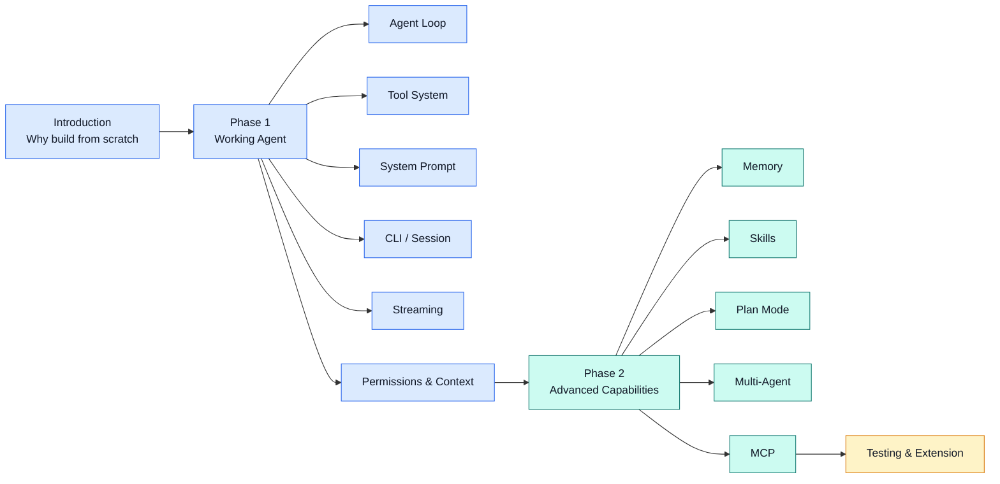
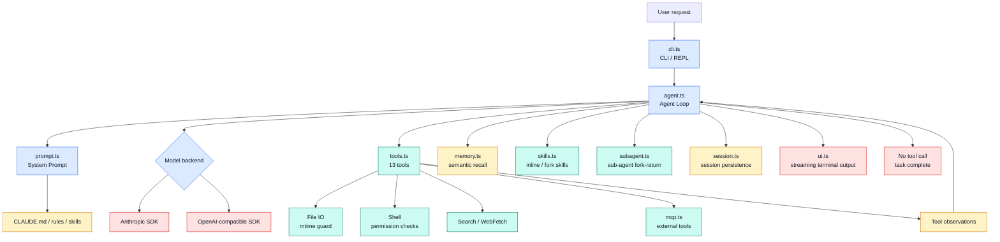
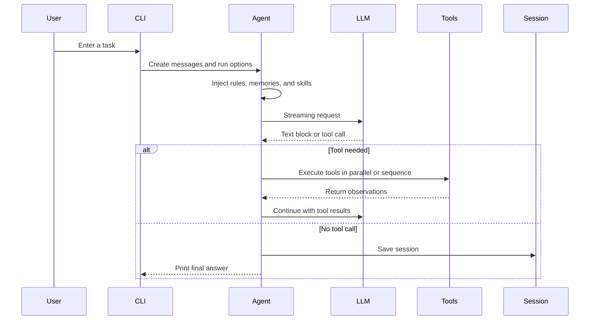

# Claude Code From Scratch

[](https://github.com/yfrcg/claude-code-from-scratch)
[](./LICENSE)
[](#)
[](#)
[](#)
[](https://yfrcg.github.io/claude-code-from-scratch/#/en/)
[](#visual-architecture)

> Build Claude Code from scratch, step by step

<p align="center">
  <a href="https://yfrcg.github.io/claude-code-from-scratch/#/en/"><strong>📘 Read Tutorial Online →</strong></a>
  &nbsp;&nbsp;|&nbsp;&nbsp;
  <a href="./README.md">中文</a>
</p>

> 📖 **Want to understand the internals?** Companion project **[How Claude Code Works](https://github.com/Windy3f3f3f3f/how-claude-code-works)** — 12 deep-dive articles, 330K+ characters, source-level analysis of Claude Code's architecture

---

**Claude Code open-sourced 500K lines of TypeScript. Too much to read?**

This project recreates Claude Code's core architecture in **~4300 lines** — Agent Loop, 13 tools (with parallel + streaming execution), 4-tier context compression, semantic memory recall, skills, multi-agent, MCP integration — with each step comparing the real source to our simplified version.

This isn't a demo — it's a **step-by-step tutorial**, from the introduction through 14 focused chapters. Follow along, write a few thousand lines of code yourself, and quickly grasp the essence of the best coding agent out there. No need to wade through hundreds of thousands of lines.

<video src="https://github.com/user-attachments/assets/4f6597e2-6ea3-45ae-8a6b-77662c4e9540" width="100%" autoplay loop muted playsinline></video>

## Highlights

| What you need | How this project covers it |
|---------|---------|
| Understand agents from first principles | Builds the loop around `model decision → tool execution → observation → next iteration` |
| Map concepts to real source | Every chapter points to the relevant Claude Code source area and the simplified implementation |
| Run the implementation | TypeScript and Python versions, with Anthropic and OpenAI-compatible backends |
| Learn production-shaped features | Permissions, context compression, memory, skills, multi-agent, MCP, budgets, and sessions |
| Read and share easily | Bilingual READMEs, online docs, testing guide, architecture diagrams, and synchronized tutorials |

## Learning Path



## Step-by-Step Tutorial

14 focused chapters in two phases — first build a working Coding Agent, then add advanced capabilities. Each chapter includes real code + Claude Code source comparison:

| Chapter | Content | Source Mapping |
|---------|---------|---------------|
| **Phase 1: Build a Working Coding Agent** | | |
| [1. Agent Loop](https://yfrcg.github.io/claude-code-from-scratch/#/en/docs/01-agent-loop) | Core loop: call LLM → execute tools → repeat | `agent.ts` ↔ `query.ts` |
| [2. Tool System](https://yfrcg.github.io/claude-code-from-scratch/#/en/docs/02-tools) | 13 tools + mtime guard + deferred loading | `tools.ts` ↔ `Tool.ts` + 66 tools |
| [3. System Prompt](https://yfrcg.github.io/claude-code-from-scratch/#/en/docs/03-system-prompt) | Prompt engineering + @include syntax | `prompt.ts` ↔ `prompts.ts` |
| [4. CLI & Sessions](https://yfrcg.github.io/claude-code-from-scratch/#/en/docs/04-cli-session) | REPL, Ctrl+C, session persistence | `cli.ts` ↔ `cli.tsx` |
| [5. Streaming](https://yfrcg.github.io/claude-code-from-scratch/#/en/docs/05-streaming) | Dual-backend + streaming tool exec + parallel | `agent.ts` ↔ `api/claude.ts` |
| [6. Permissions](https://yfrcg.github.io/claude-code-from-scratch/#/en/docs/06-permissions) | 5 modes + declarative rules + danger detection | `tools.ts` ↔ `permissions/` (52KB) |
| [7. Context](https://yfrcg.github.io/claude-code-from-scratch/#/en/docs/07-context) | 4-tier compression + large result persistence | `agent.ts` ↔ `compact/` |
| **Phase 2: Advanced Capabilities** | | |
| [8. Memory](https://yfrcg.github.io/claude-code-from-scratch/#/en/docs/08-memory) | 4-type memory + semantic recall + async prefetch | `memory.ts` ↔ `memory.ts` |
| [9. Skills](https://yfrcg.github.io/claude-code-from-scratch/#/en/docs/09-skills) | Skill discovery + inline/fork dual mode | `skills.ts` ↔ `SkillTool/` |
| [10. Plan Mode](https://yfrcg.github.io/claude-code-from-scratch/#/en/docs/10-plan-mode) | Read-only planning + 4-option approval workflow | `agent.ts` ↔ `EnterPlanMode` |
| [11. Multi-Agent](https://yfrcg.github.io/claude-code-from-scratch/#/en/docs/11-multi-agent) | Sub-Agent fork-return architecture | `subagent.ts` ↔ `AgentTool/` |
| [12. MCP Integration](https://yfrcg.github.io/claude-code-from-scratch/#/en/docs/12-mcp) | JSON-RPC over stdio for external tools | `mcp.ts` ↔ `mcpClient.ts` |
| [13. Comparison](https://yfrcg.github.io/claude-code-from-scratch/#/en/docs/13-whats-next) | Full comparison + extension ideas | Global |
| [14. Testing](https://yfrcg.github.io/claude-code-from-scratch/#/en/docs/14-testing) | 19 manual tests covering all features | `test/` |

## Quick Start

```bash
git clone https://github.com/yfrcg/claude-code-from-scratch.git
cd claude-code-from-scratch
npm install && npm run build
```

### API Configuration

Two backends supported, auto-detected via environment variables:

**Option 1: Anthropic Format (Recommended)**

```bash
export ANTHROPIC_API_KEY="sk-ant-xxx"
# Optional: use a proxy
export ANTHROPIC_BASE_URL="https://aihubmix.com"
```

**Option 2: OpenAI-Compatible Format**

```bash
export OPENAI_API_KEY="sk-xxx"
export OPENAI_BASE_URL="https://api.openai.com/v1"
```

Default model is `claude-opus-4-6`. Customize via env var or CLI flag:

```bash
export MINI_CLAUDE_MODEL="claude-sonnet-4-6"    # env var
npm start -- --model gpt-4o                      # CLI flag (higher priority)
```

### Run

**TypeScript**

```bash
npm start                    # Interactive REPL mode (recommended)
npm start -- --resume        # Resume last session
npm start -- --yolo          # Skip safety confirmations
npm start -- --plan          # Plan mode: analyze only, no modifications
npm start -- --accept-edits  # Auto-approve file edits
npm start -- --dont-ask      # CI mode: auto-deny confirmable actions
npm start -- --max-cost 0.50 # Cost limit (USD)
npm start -- --max-turns 20  # Turn limit
```

**Python**

```bash
mini-claude-py               # Interactive REPL mode (recommended)
mini-claude-py --resume      # Resume last session
mini-claude-py --yolo        # Skip safety confirmations
mini-claude-py --plan        # Plan mode: analyze only, no modifications
mini-claude-py --accept-edits # Auto-approve file edits
mini-claude-py --dont-ask    # CI mode: auto-deny confirmable actions
mini-claude-py --max-cost 0.50 # Cost limit (USD)
mini-claude-py --max-turns 20  # Turn limit
```

Install globally to use from any directory:

**TypeScript**

```bash
npm link                     # Global install
cd ~/your-project
mini-claude                  # Launch directly
```

**Python**

```bash
cd python
pip install -e .             # Global install (editable mode)
cd ~/your-project
mini-claude-py               # Launch directly
```

### REPL Commands

| Command | Function |
|---------|----------|
| `/clear` | Clear conversation history |
| `/cost` | Show cumulative token usage and cost |
| `/compact` | Manually trigger conversation compaction |
| `/memory` | List saved memories |
| `/skills` | List available skills |
| `/<skill>` | Invoke a registered skill (e.g. `/commit`) |

> See [CLI & Sessions](https://yfrcg.github.io/claude-code-from-scratch/#/en/docs/04-cli-session) and [Testing](https://yfrcg.github.io/claude-code-from-scratch/#/en/docs/14-testing)

## Comparison with Claude Code

| Aspect | Claude Code | Mini Claude Code |
|--------|------------|-----------------|
| Purpose | Production coding agent | Educational / minimal |
| Tools | 66+ built-in | 13 tools (6 core + web_fetch + tool_search + skill + agent + plan mode) |
| Tool Execution | Concurrent + streaming early start | Parallel + streaming early start |
| Context | 4-level compression pipeline | 4-tier compression + large result persistence (>30KB) |
| Permissions | 7-layer + AST analysis | 5 modes + declarative rules + regex detection |
| Edit Validation | 14-step pipeline | Quote normalization + uniqueness + mtime guard + diff output |
| Memory | 4 types + semantic recall | 4 types + semantic recall + async prefetch |
| Skills | 6 sources + inline/fork | 2 sources + inline/fork |
| Multi-Agent | Sub-Agent + Coordinator + Swarm | Sub-Agent (3 built-in + custom agents) |
| MCP Integration | mcpClient.ts + dynamic tool discovery | McpManager + JSON-RPC over stdio |
| Budget Control | USD/turns/abort | USD + turn limits |
| Code Size | 500k+ lines | ~4300 lines (TS) / ~3800 lines (Python) |

## Core Capabilities

- **Agent Loop**: Automatically calls tools, processes results, iterates until done
- **13 Tools**: Read/write/edit files (mtime guard), search, shell, WebFetch, ToolSearch (deferred loading), skills, sub-agents, Plan Mode
- **Streaming**: Real-time output, Anthropic + OpenAI backends, streaming tool early execution
- **Parallel Tool Execution**: Read-only tools (read_file, grep_search, etc.) auto-parallelized, 2-3x speedup
- **4-Tier Context Compression**: Budget trimming → stale snip → microcompact → auto-compact + large result persistence (>30KB to disk)
- **Permission System**: 5 modes + declarative allow/deny rules in `.claude/settings.json` + 16 dangerous command patterns
- **Memory System**: 4 types + semantic recall (sideQuery model selection) + async prefetch
- **Skills System**: Load reusable prompt templates, supports inline injection and fork sub-agent execution
- **Multi-Agent**: Sub-Agent fork-return pattern (3 built-in + `.claude/agents/` custom types)
- **MCP Integration**: JSON-RPC over stdio to connect external tool servers, dynamic tool discovery
- **System Prompt**: @include syntax for recursive imports, .claude/rules/ auto-loading, template variables
- **Extended Thinking**: Anthropic extended thinking support (`--thinking`), adaptive/enabled/disabled modes
- **Budget Control**: `--max-cost` USD limit + `--max-turns` turn limit, auto-stop on exceed
- **Session Persistence**: Auto-save conversations, `--resume` to restore
- **Cross-Platform**: Windows / macOS / Linux, auto-detects shell (PowerShell / bash / zsh)
- **Error Recovery**: Exponential backoff + random jitter retry (max 3 attempts), graceful Ctrl+C

## Project Structure

```
src/
├── agent.ts        # Agent loop: streaming, parallel exec, 4-tier compress  (1501 lines)
├── tools.ts        # Tools: 13 tools + mtime guard + deferred loading       (858 lines)
├── cli.ts          # CLI entry: args, REPL, budget flags                    (371 lines)
├── memory.ts       # Memory: 4 types + semantic recall + async prefetch     (376 lines)
├── mcp.ts          # MCP client: JSON-RPC over stdio                        (266 lines)
├── prompt.ts       # System prompt: @include + template + injection         (230 lines)
├── ui.ts           # Terminal output: colors, formatting, sub-agent         (211 lines)
├── subagent.ts     # Sub-agent: 3 built-in + custom agent discovery         (199 lines)
├── skills.ts       # Skills system: discovery + inline/fork modes           (175 lines)
├── session.ts      # Session persistence: save/load/list                    (63 lines)
├── frontmatter.ts  # Shared YAML frontmatter parser                         (41 lines)
                                                            Total: ~4291 lines
```

## Visual Architecture





## Related Projects

- **[how-claude-code-works](https://github.com/Windy3f3f3f3f/how-claude-code-works)** — Deep dive into Claude Code's architecture (12 articles, 330K+ characters)

## License

MIT
