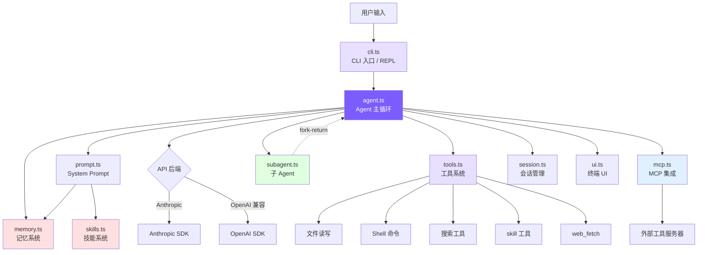

# 引言：为什么从零造一个 Claude Code？

## 本章目标

理解项目定位、技术栈选择和整体架构，5 分钟内跑起来你自己的 coding agent。

## 为什么要从零造？

### AI 编程的三个阶段

AI 辅助编程大致经历了三个阶段：**代码补全**（Copilot）→ **聊天助手**（Cursor Chat）→ **自主 Agent**（Claude Code）。

前两个阶段的共同限制是：**模型不能执行操作**。它只能给建议，无法自己跑测试看结果。

Claude Code 是一个质的飞跃。你说"给这个项目加用户注册功能"，它会自己搜索路由定义、读取数据库模型、创建 handler 文件、注册路由、写测试、运行 `npm test`、看到失败、修复、再跑——循环十几次，直到通过为止。

这就是 **受控工具循环 Agent**：模型是决策者，代码只是执行环境。

### Agent-first 意味着什么

传统程序里，代码逻辑决定行为——`if/else` 都是程序员预先写好的。Agent 架构反过来：**模型决定下一步做什么**，代码只提供循环框架和工具。

整个系统的核心是一个 `while (true)` 循环：

```
while (true) {
    调用模型 → 模型返回响应
    if (响应包含工具调用) → 执行工具 → 把结果喂回模型 → 继续循环
    if (响应只是文本) → 任务完成，退出循环
}
```

**只有当模型的响应不包含任何工具调用时，循环才会退出**——是模型，而不是代码逻辑，决定任务是否完成。

### 为什么不直接读源码

Claude Code 的开源快照有 50 万行 TypeScript：66+ 工具、React/Ink TUI、MCP 协议、OAuth 认证、多代理系统……直接读很容易迷失在边界情况和抽象层里。

我们的做法：**只保留最小必要组件**，用 ~3400 行代码复现核心能力（记忆、技能、多 Agent、权限规则、分级压缩、预算控制、Plan Mode），每一步对照真实源码讲解。就像造卡丁车来理解汽车原理——引擎、方向盘、刹车都在，空调音响先不管。

## 核心概念速览

**Agent Loop**：思考—行动—观察的循环。模型收到请求后决定调用哪个工具，系统执行工具并把结果反馈给模型，模型继续思考，直到不再发出工具调用。

**工具系统**：工具是 Agent 和真实世界交互的桥梁。我们在 System Prompt 里描述每个工具的名字和参数，模型需要时返回结构化的工具调用请求，代码执行后把结果喂回去。

**上下文工程**：模型的表现完全取决于它看到了什么。上下文窗口有限（200K tokens），但复杂任务可能跑几十轮——所以需要压缩。我们实现了 4 级压缩：裁剪大块输出 → 摘要工具结果 → 模型总结整段对话，每级比上一级激进，系统尽量用最轻的方式解决问题。

**System Prompt**：每次 API 调用前组装的第一条消息，告诉模型当前操作系统、工作目录、Git 状态、项目规则（CLAUDE.md）、可用工具列表。这些上下文直接影响模型的决策质量。

**权限与安全**：能执行任意 Shell 命令的 Agent 需要安全控制。我们实现了 5 种权限模式，从"全部放行"到"全部询问用户"——写文件前检查是否允许，危险操作需要确认。

## 架构全景



主线很清晰：**用户输入 → CLI → Agent Loop → 模型决策 → 工具执行 → 结果反馈 → 循环直到完成**

各组件职责：

- **`cli.ts`**：解析命令行参数，提供交互式 REPL
- **`agent.ts`**：核心引擎（~1263 行）。组装消息、调用 API、解析响应、执行工具、压缩上下文、控制预算
- **`prompt.ts`**：把静态提示词模板和动态环境信息（OS、目录、Git 状态、记忆、技能）拼成 System Prompt
- **`tools.ts`**：13 个工具的定义 + 执行逻辑 + 权限检查 + 延迟加载
- **`memory.ts` / `skills.ts`**：记忆让 Agent 跨会话记住信息（支持语义召回），技能提供可复用的操作序列，两者都在启动时注入 System Prompt
- **`subagent.ts`**：当任务超出单个上下文窗口时，fork 子 Agent 处理子任务，完成后返回结果
- **`mcp.ts`**：MCP 协议客户端，通过 JSON-RPC over stdio 连接外部工具服务器
- **`session.ts`**：把对话历史写到磁盘，支持 `--resume` 恢复
- **`ui.ts`**：终端颜色和格式化输出

| 文件 | 行数 | 职责 |
|------|------|------|
| `agent.ts` | ~1263 | Agent 主循环：消息构造、API 调用、工具编排、流式执行、子 Agent、4 层压缩、预算控制、Plan Mode |
| `tools.ts` | ~850 | 工具定义 + 执行：13 个工具 + 5 种权限模式 + mtime 防护 + 延迟加载 |
| `cli.ts` | ~371 | CLI 入口、参数解析、REPL 交互 |
| `memory.ts` | ~325 | 记忆系统：4 类型 + 文件存储 + 语义召回 + 异步预取 |
| `mcp.ts` | ~266 | MCP 客户端：JSON-RPC over stdio、工具发现与调用转发 |
| `ui.ts` | ~211 | 终端输出：颜色、格式化 |
| `skills.ts` | ~175 | 技能系统：目录发现 + frontmatter 解析 + inline/fork 双模式 |
| `subagent.ts` | ~199 | 子 Agent 配置（3 内置 + 自定义 Agent 发现） |
| `prompt.ts` | ~154 | System Prompt 构造：模板 + @include + 变量替换 + 记忆/技能注入 |
| `session.ts` | ~63 | 会话持久化：JSON 文件存储 |
| `frontmatter.ts` | ~41 | YAML frontmatter 解析器 |
| `python/` | — | Python 版完整实现（`mini_claude/` 包，~2920 行） |

## 技术栈

TypeScript 和 Python 两个版本分别实现，选你熟悉的看就行。

<!-- tabs:start -->
#### **TypeScript**

```
TypeScript           — 类型安全，与 Claude Code 同语言
@anthropic-ai/sdk    — Anthropic 官方 SDK
openai               — OpenAI 兼容后端支持
chalk                — 终端颜色输出
glob                 — 文件模式匹配
```

#### **Python**

```
Python 3.11+         — 简洁易读
anthropic            — Anthropic 官方 SDK
openai               — OpenAI 兼容后端支持
```
<!-- tabs:end -->

没有框架、没有构建工具链，只有最基础的依赖。

## 快速开始

<!-- tabs:start -->
#### **TypeScript**

```bash
git clone https://github.com/yfrcg/claude-code-from-scratch.git
cd claude-code-from-scratch
npm install
export ANTHROPIC_API_KEY=sk-ant-xxx
npm run dev
```

#### **Python**

```bash
git clone https://github.com/yfrcg/claude-code-from-scratch.git
cd claude-code-from-scratch/python
pip install -e .
export ANTHROPIC_API_KEY=sk-ant-xxx
mini-claude-py "hello"
```
<!-- tabs:end -->

启动后：

```
  Mini Claude Code — A minimal coding agent

  Type your request, or 'exit' to quit.
  Commands: /clear /cost /compact /memory /skills /plan

>
```

试试 `read src/agent.ts and explain the main loop`。

### 其他选项

```bash
mini-claude --yolo "run all tests"          # 跳过所有确认
mini-claude --plan "analyze this codebase"  # 只分析不修改
mini-claude --accept-edits "refactor"       # 自动批准文件编辑
mini-claude --dont-ask "check style"        # 需确认的操作自动拒绝
mini-claude --thinking "analyze this bug"   # 启用 Extended Thinking
mini-claude --resume                        # 恢复上次会话
mini-claude --max-cost 0.50 --max-turns 20  # 预算控制
```

## 各章概览

| 章节 | mini-claude 文件 | Claude Code 对应源码 |
|------|-----------------|---------------------|
| **Phase 1: 构建一个可用的 Coding Agent** | | |
| [1. Agent Loop](docs/01-agent-loop.md) | `agent.ts` 的 `chatAnthropic()` | `src/query.ts` 的 `queryLoop` |
| [2. 工具系统](docs/02-tools.md) | `tools.ts` | `src/Tool.ts` + `src/tools/` (66+ 工具) |
| [3. System Prompt](docs/03-system-prompt.md) | `prompt.ts` | `src/constants/prompts.ts` |
| [4. CLI 与会话](docs/04-cli-session.md) | `cli.ts` + `session.ts` | `src/entrypoints/cli.tsx` |
| [5. 流式输出](docs/05-streaming.md) | `agent.ts` 的两套 stream 方法 | `src/services/api/claude.ts` |
| [6. 权限与安全](docs/06-permissions.md) | `tools.ts` 的 `checkPermission()` + 规则配置 | `src/utils/permissions/` (52KB) |
| [7. 上下文管理](docs/07-context.md) | `agent.ts` 的 `checkAndCompact()` | `src/services/compact/` |
| **Phase 2: 进阶能力** | | |
| [8. 记忆系统](docs/08-memory.md) | `memory.ts` | `src/utils/memory.ts` |
| [9. 技能系统](docs/09-skills.md) | `skills.ts` | `src/utils/skills.ts` + `src/tools/SkillTool/` |
| [10. Plan Mode](docs/10-plan-mode.md) | `agent.ts` + `tools.ts` + `cli.ts` | `EnterPlanMode` / `ExitPlanMode` |
| [11. 多 Agent](docs/11-multi-agent.md) | `subagent.ts` + `agent.ts` | `src/tools/AgentTool/` |
| [12. MCP 集成](docs/12-mcp.md) | `mcp.ts` | `src/services/mcpClient.ts` |
| [13. 架构对比](docs/13-whats-next.md) | 全局对比 | 全局对比 |

---

> **下一章**：从最核心的部分开始——Agent Loop，这是整个 coding agent 的心脏。
