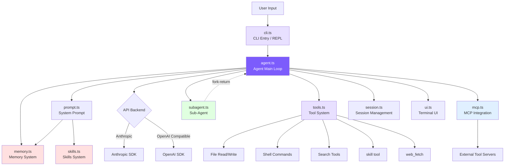

# Introduction: Why Build a Claude Code from Scratch?

## Chapter Goals

Understand the project's positioning, technology stack choices, and overall architecture. Get your own coding agent running in 5 minutes.

## Why Build from Scratch?

### Three Phases of AI Programming

AI-assisted programming has gone through roughly three phases: **code completion** (Copilot) -> **chat assistant** (Cursor Chat) -> **autonomous Agent** (Claude Code).

The first two phases share the same limitation: **the model cannot take actions**. It can only offer suggestions -- it can't run tests and see the results on its own.

Claude Code is a qualitative leap. You say "add user registration to this project," and it will search for route definitions, read database models, create handler files, register routes, write tests, run `npm test`, see failures, fix them, run again -- looping dozens of times until everything passes.

This is the **controlled tool-loop Agent**: the model is the decision-maker, and code is just the execution environment.

### What Agent-first Means

In traditional programs, code logic determines behavior -- every `if/else` is written in advance by the programmer. Agent architecture reverses this: **the model decides what to do next**, and the code merely provides the loop framework and tools.

The core of the entire system is a `while (true)` loop:

```
while (true) {
    call model -> model returns response
    if (response contains tool calls) -> execute tools -> feed results back to model -> continue loop
    if (response is just text) -> task complete, exit loop
}
```

**The loop only exits when the model's response contains no tool calls** -- it's the model, not the code logic, that decides whether the task is complete.

### Why Not Just Read the Source Code

Claude Code's open-source snapshot has 500,000 lines of TypeScript: 66+ tools, React/Ink TUI, MCP protocol, OAuth authentication, multi-agent system... Diving straight in makes it easy to get lost in edge cases and abstraction layers.

Our approach: **keep only the minimal necessary components**, reproducing core capabilities in ~3400 lines of code (memory, skills, multi-Agent, permission rules, tiered compaction, budget control, Plan Mode), with each step explained against the real source code. It's like building a go-kart to understand how cars work -- engine, steering wheel, and brakes are all there; air conditioning and stereo can wait.

## Core Concepts at a Glance

**Agent Loop**: The think-act-observe cycle. After receiving a request, the model decides which tool to call. The system executes the tool and feeds the result back to the model, which continues thinking until it no longer issues tool calls.

**Tool System**: Tools are the bridge between the Agent and the real world. We describe each tool's name and parameters in the System Prompt. When the model needs one, it returns a structured tool call request, and the code executes it and feeds the result back.

**Context Engineering**: The model's performance depends entirely on what it sees. The context window is limited (200K tokens), but complex tasks may run dozens of rounds -- so compaction is needed. We implement 4 levels of compaction: trim large outputs -> summarize tool results -> model summarizes the entire conversation. Each level is more aggressive than the last, and the system tries to solve the problem with the lightest approach possible.

**System Prompt**: The first message assembled before every API call, telling the model the current operating system, working directory, Git status, project rules (CLAUDE.md), and available tool list. This context directly affects the quality of the model's decisions.

**Permissions and Security**: An Agent that can execute arbitrary shell commands needs safety controls. We implement 5 permission modes, from "allow everything" to "ask the user for everything" -- checking whether writes are allowed before they happen, and requiring confirmation for dangerous operations.

## Architecture Overview



The main flow is clear: **User input -> CLI -> Agent Loop -> Model decision -> Tool execution -> Result feedback -> Loop until complete**

Component responsibilities:

- **`cli.ts`**: Parses command-line arguments, provides interactive REPL
- **`agent.ts`**: Core engine (~1263 lines). Assembles messages, calls API, parses responses, executes tools, compacts context, controls budget
- **`prompt.ts`**: Combines static prompt template with dynamic environment info (OS, directory, Git status, memory, skills) into the System Prompt
- **`tools.ts`**: Definitions + execution logic + permission checks + deferred loading for 13 tools
- **`memory.ts` / `skills.ts`**: Memory lets the Agent remember information across sessions (with semantic recall); skills provide reusable action sequences. Both are injected into the System Prompt at startup
- **`subagent.ts`**: When a task exceeds a single context window, forks a sub-Agent to handle the subtask and returns the result
- **`mcp.ts`**: MCP protocol client, connects to external tool servers via JSON-RPC over stdio
- **`session.ts`**: Writes conversation history to disk, supports `--resume` to restore
- **`ui.ts`**: Terminal colors and formatted output

| File | Lines | Responsibility |
|------|-------|----------------|
| `agent.ts` | ~1263 | Agent main loop: message construction, API calls, tool orchestration, streaming execution, sub-Agent, 4-tier compaction, budget control, Plan Mode |
| `tools.ts` | ~850 | Tool definitions + execution: 13 tools + 5 permission modes + mtime protection + deferred loading |
| `cli.ts` | ~371 | CLI entry, argument parsing, REPL interaction |
| `memory.ts` | ~325 | Memory system: 4 types + file storage + semantic recall + async prefetch |
| `mcp.ts` | ~266 | MCP client: JSON-RPC over stdio, tool discovery and call forwarding |
| `ui.ts` | ~211 | Terminal output: colors, formatting |
| `skills.ts` | ~175 | Skills system: directory discovery + frontmatter parsing + inline/fork dual modes |
| `subagent.ts` | ~199 | Sub-Agent configuration (3 built-in + custom Agent discovery) |
| `prompt.ts` | ~154 | System Prompt construction: template + @include + variable substitution + memory/skills injection |
| `session.ts` | ~63 | Session persistence: JSON file storage |
| `frontmatter.ts` | ~41 | YAML frontmatter parser |
| `python/` | -- | Full Python implementation (`mini_claude/` package, ~2920 lines) |

## Technology Stack

Both TypeScript and Python versions are implemented separately -- just pick whichever you're comfortable with.

<!-- tabs:start -->
#### **TypeScript**

```
TypeScript           -- Type safety, same language as Claude Code
@anthropic-ai/sdk    -- Anthropic official SDK
openai               -- OpenAI compatible backend support
chalk                -- Terminal color output
glob                 -- File pattern matching
```

#### **Python**

```
Python 3.11+         -- Clean and readable
anthropic            -- Anthropic official SDK
openai               -- OpenAI compatible backend support
```
<!-- tabs:end -->

No frameworks, no build toolchains -- just the most basic dependencies.

## Quick Start

<!-- tabs:start -->
#### **TypeScript**

```bash
git clone https://github.com/yfrcg/claude-code-from-scratch.git
cd claude-code-from-scratch
npm install
export ANTHROPIC_API_KEY=sk-ant-xxx
npm run dev
```

#### **Python**

```bash
git clone https://github.com/yfrcg/claude-code-from-scratch.git
cd claude-code-from-scratch/python
pip install -e .
export ANTHROPIC_API_KEY=sk-ant-xxx
mini-claude-py "hello"
```
<!-- tabs:end -->

After starting:

```
  Mini Claude Code — A minimal coding agent

  Type your request, or 'exit' to quit.
  Commands: /clear /cost /compact /memory /skills /plan

>
```

Try `read src/agent.ts and explain the main loop`.

### Other Options

```bash
mini-claude --yolo "run all tests"          # Skip all confirmations
mini-claude --plan "analyze this codebase"  # Analyze only, no modifications
mini-claude --accept-edits "refactor"       # Auto-approve file edits
mini-claude --dont-ask "check style"        # Auto-deny operations requiring confirmation
mini-claude --thinking "analyze this bug"   # Enable Extended Thinking
mini-claude --resume                        # Resume last session
mini-claude --max-cost 0.50 --max-turns 20  # Budget control
```

## Chapter Overview

| Chapter | mini-claude File | Corresponding Claude Code Source |
|---------|-----------------|----------------------------------|
| **Phase 1: Building a Working Coding Agent** | | |
| [1. Agent Loop](/en/docs/01-agent-loop.md) | `agent.ts`'s `chatAnthropic()` | `src/query.ts`'s `queryLoop` |
| [2. Tool System](/en/docs/02-tools.md) | `tools.ts` | `src/Tool.ts` + `src/tools/` (66+ tools) |
| [3. System Prompt](/en/docs/03-system-prompt.md) | `prompt.ts` | `src/constants/prompts.ts` |
| [4. CLI and Sessions](/en/docs/04-cli-session.md) | `cli.ts` + `session.ts` | `src/entrypoints/cli.tsx` |
| [5. Streaming Output](/en/docs/05-streaming.md) | `agent.ts`'s two stream methods | `src/services/api/claude.ts` |
| [6. Permissions and Security](/en/docs/06-permissions.md) | `tools.ts`'s `checkPermission()` + rule config | `src/utils/permissions/` (52KB) |
| [7. Context Management](/en/docs/07-context.md) | `agent.ts`'s `checkAndCompact()` | `src/services/compact/` |
| **Phase 2: Advanced Capabilities** | | |
| [8. Memory System](/en/docs/08-memory.md) | `memory.ts` | `src/utils/memory.ts` |
| [9. Skills System](/en/docs/09-skills.md) | `skills.ts` | `src/utils/skills.ts` + `src/tools/SkillTool/` |
| [10. Plan Mode](/en/docs/10-plan-mode.md) | `agent.ts` + `tools.ts` + `cli.ts` | `EnterPlanMode` / `ExitPlanMode` |
| [11. Multi-Agent](/en/docs/11-multi-agent.md) | `subagent.ts` + `agent.ts` | `src/tools/AgentTool/` |
| [12. MCP Integration](/en/docs/12-mcp.md) | `mcp.ts` | `src/services/mcpClient.ts` |
| [13. Architecture Comparison](/en/docs/13-whats-next.md) | Full comparison | Full comparison |

---

> **Next chapter**: Let's start with the most critical part -- the Agent Loop, the heart of the entire coding agent.
